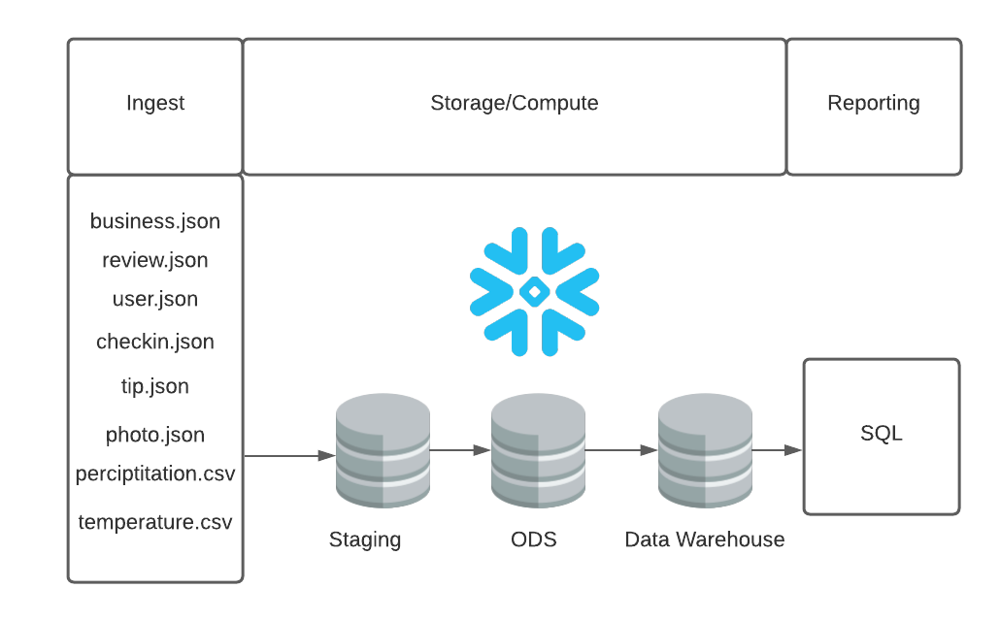
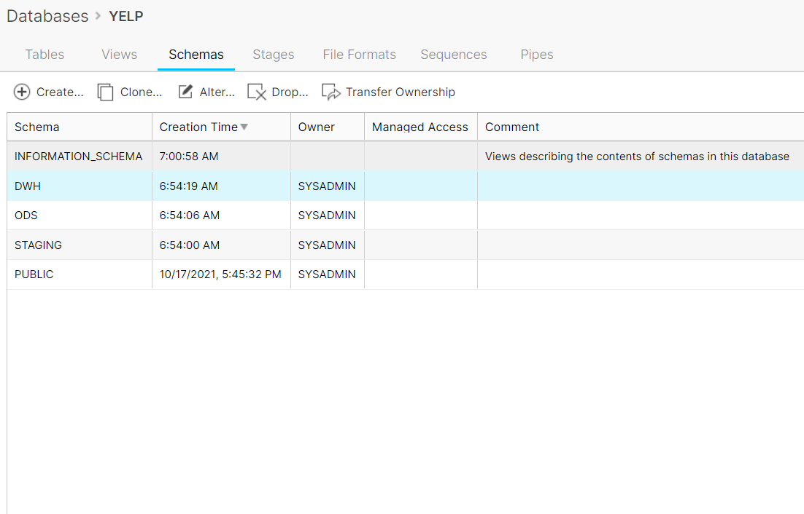
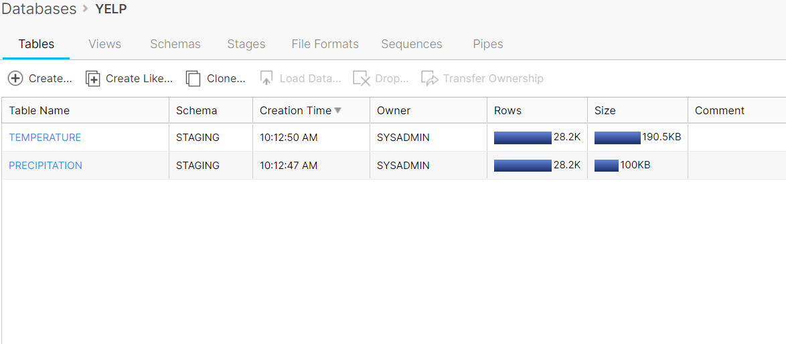
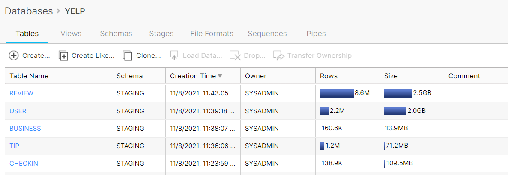

# Snowflake Warehouse
Snowflake warehouse which takes in raw weather and restaurants (YELP) data into a **Staging** location. Then we transform those raw datasets into a refined **Operational Data Store** area. Lastly, the weather data and restaurant datasets are joined to provide a final reporting layer, **Data Warehouse**, to answer the question around how the effects of weather have on restaurant reviews. 
 
## Architecture Diagram

## ERM 

## Schema

## Creating Raw tables

