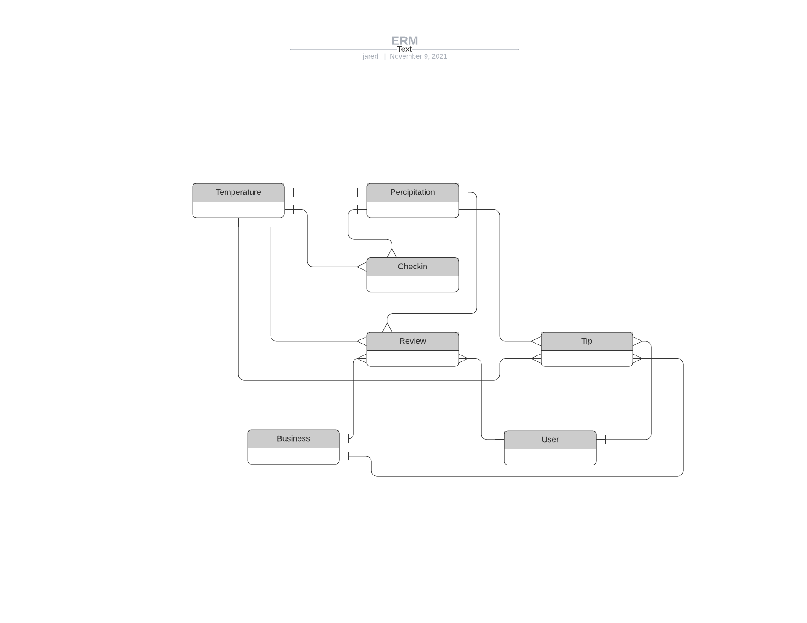
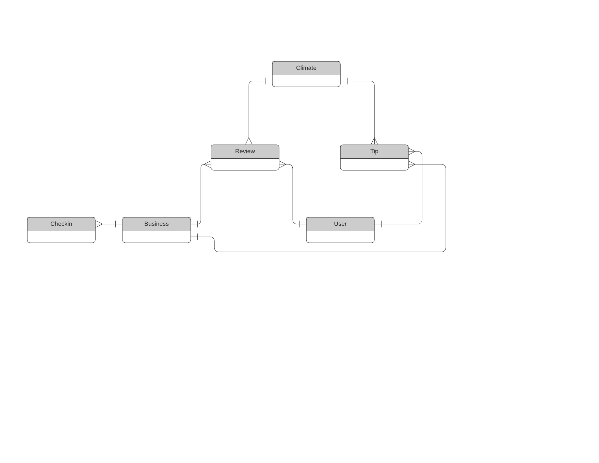
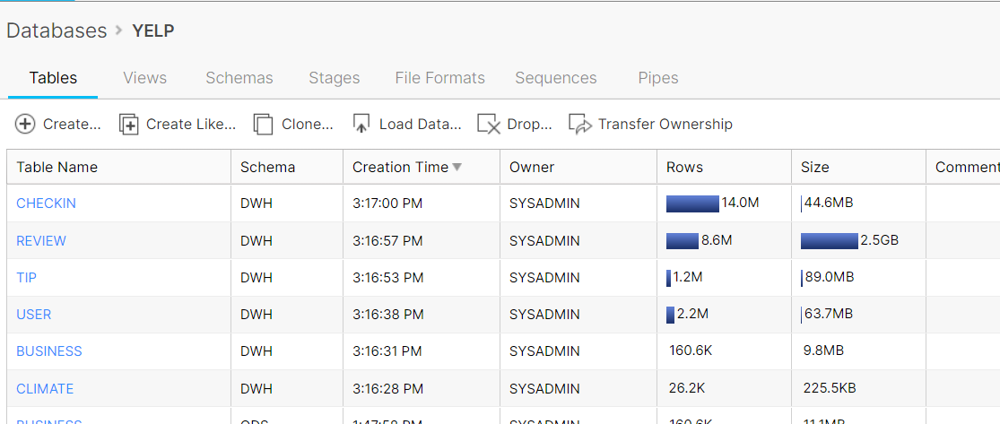

# Snowflake Warehouse
Snowflake warehouse which takes in raw weather and restaurants (YELP) data into a **Staging** location. Then we transform those raw datasets into a refined **Operational Data Store** area. Lastly, the weather data and restaurant datasets are joined to provide a final reporting layer, **Data Warehouse**, to answer the question around how the effects of weather have on restaurant reviews. 
 

## Architecture Diagram


## Downloading the dataset

### Datasets
[Climate dataset](https://crt-climate-explorer.nemac.org/)

[Yelp dataset](https://www.yelp.com/dataset/download)

### How to unzip tar files
[UnzipTar](https://linuxize.com/post/how-to-extract-unzip-tar-gz-file/)

## ERM 



## Schema


## Uploading data to Stage areas

Uploading using web portal


Uploading using snowflake client to stage area


## Creating Staging tables


## Creating ODS tables


## Star Schema 



## Creating DWH tables




## Query to find climate and business name and rating

```sql
    USE YELP;

    SELECT CLIMATE.PRECIPITATION, 
        CLIMATE.TEMPERATURE_MIN, 
        CLIMATE.TEMPERATURE_MAX, 
        BUSINESS.NAME, 
        BUSINESS.STARS
    FROM DWH.CLIMATE
    JOIN DWH.REVIEW ON DWH.CLIMATE.DATE = DWH.REVIEW.DATE
    JOIN DWH.BUSINESS ON DWH.REVIEW.BUSINESS_ID = DWH.BUSINESS.BUSINESS_ID;
```